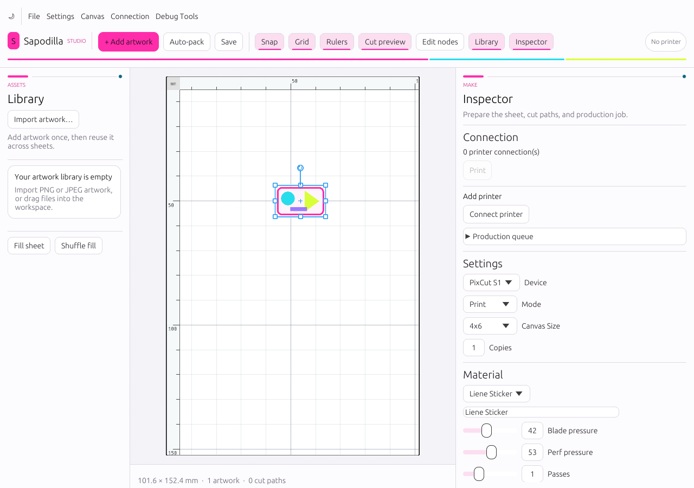
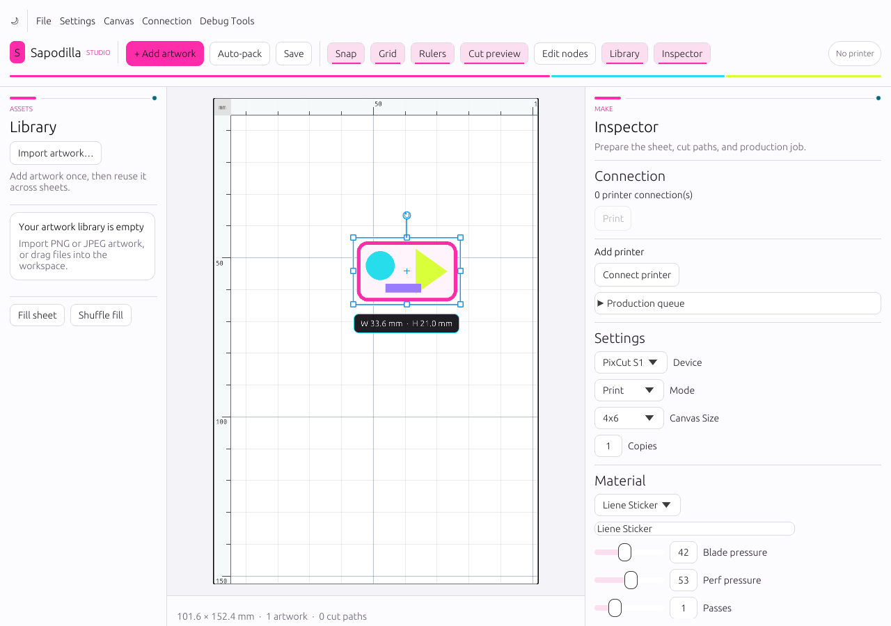
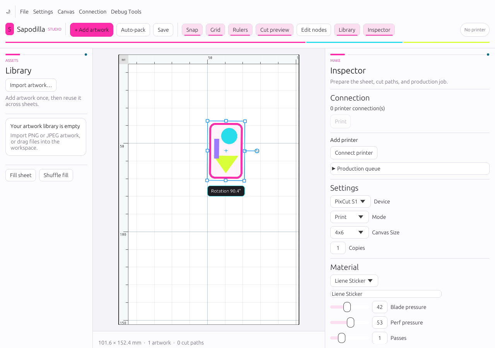

# In-canvas direct manipulation review

Date: 2026-09-03

## Interaction target

Adobe's object-selection model establishes a visible bounding box around the active object,
supports corner and side scaling, rotates from outside the bounds, and uses modifiers for
constrained or center-based transforms. The goal here is the same interaction vocabulary, not a
copy of Adobe artwork, icons, or interface chrome.

Primary references:

- [Adobe Illustrator: select and transform with selection tools](https://helpx.adobe.com/illustrator/desktop/manage-objects/select-objects/select-transform-objects-selection-tools.html)
- [Adobe Illustrator: transform objects](https://helpx.adobe.com/uk/illustrator/desktop/manage-objects/reshape-transform-objects/transform-objects.html)
- [Adobe Illustrator: scale objects](https://helpx.adobe.com/illustrator/desktop/manage-objects/reshape-transform-objects/scale-objects.html)
- [Adobe Photoshop: free transformations](https://helpx.adobe.com/photoshop/using/free-transformations-images-shapes-paths.html)

## Implemented behavior

- Selecting artwork exposes an oriented bounding box with four corner and four side handles.
- Corner handles resize both object-local axes; side handles resize one axis when proportions are
  unlocked. The opposite handle stays anchored.
- Shift temporarily toggles the artwork's visible proportions-lock setting.
- Alt/Option scales from the object center instead of the opposite handle.
- Resize cursors follow the object's rotation rather than remaining screen-axis fixed.
- Rotation is available from the visible stem handle and generous zones outside all four corners.
  Shift snaps the result to 15-degree increments.
- Rotation uses the gesture-start angle and initial object rotation, preventing a jump when the
  pointer grabs the edge of the hit region.
- A high-contrast in-canvas badge reports live width/height in millimeters or rotation in degrees.
- Escape restores the gesture-start transform. Pointer release commits the current transform.
- Dragging previously unselected artwork selects it before moving it. Dragging an item within a
  multi-selection translates every visible, unlocked selected item together.
- Transform targets are 26 screen pixels while their visual handles remain compact. Selection
  bounds use a white halo plus blue stroke so they remain visible over light and dark artwork.

The 26-pixel targets meet WCAG 2.2's 24-by-24 minimum target benchmark. The inspector retains
keyboard-operable X/Y/W/H fields, a proportions lock, and a numeric rotation control; broader web
semantic exposure is still constrained by the current eframe web backend. [WCAG Target Size](https://www.w3.org/WAI/WCAG22/Understanding/target-size-minimum.html),
[WCAG Keyboard](https://www.w3.org/WAI/WCAG22/Understanding/keyboard.html),
[WCAG Non-text Contrast](https://www.w3.org/WAI/WCAG22/Understanding/non-text-contrast.html).

## Visual evidence

## Repeatable verification

1. `cargo test --no-default-features views::canvas::tests` covers all eight handles at 0°, 37°,
   90°, and -135°; opposite anchors; aspect locking and finite clamps; center scaling; rotated
   cursors; no-jump rotation and 15° snap; and handle pointer priority.
2. `scripts/verify-transform-ui.ps1` builds the WASM app, imports the deterministic fixture,
   selects and moves it, captures the eight-handle state, resizes with a live millimeter badge,
   rotates with a live angle badge, and records the browser accessibility snapshot.
3. The full native test suite and a `wasm32-unknown-unknown` compile check protect document,
   production, and browser boundaries.

## Remaining extension points

- A shared resize/rotation bounding box for multi-selection; this pass provides group movement.
- Marquee selection and blank-canvas deselection without conflicting with Scene pan/zoom.
- One-gesture undo history and keyboard arrow nudging.
- A visible reference-point control for numeric transforms.
- Full semantic web exposure of custom canvas handles when eframe's web accessibility boundary
  supports it.
