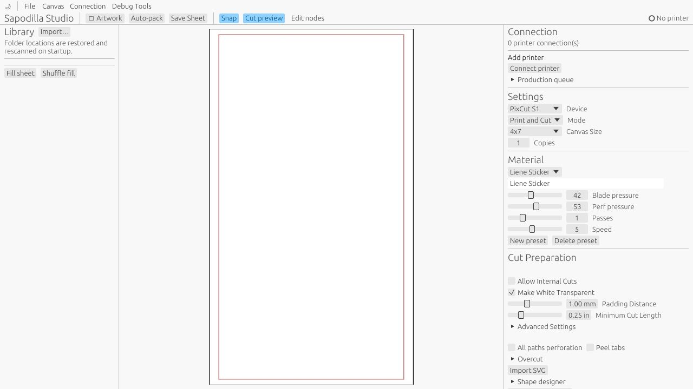
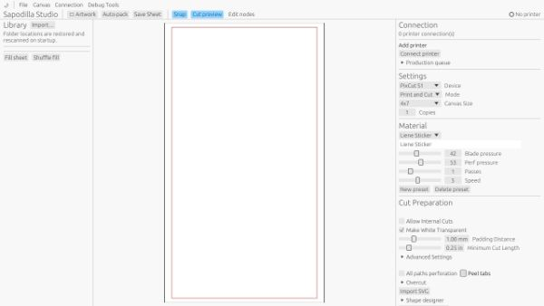
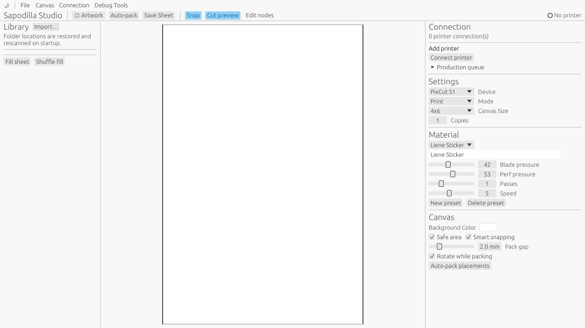
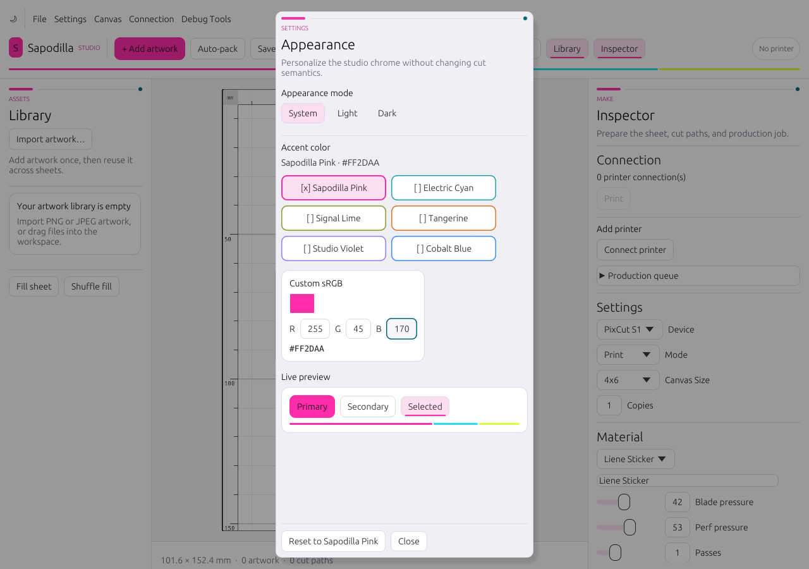

# Sapodilla UX, human-factors, and visual-direction review

Date: 2026-09-03
Baseline reviewed: `b637011` (hosted WASM build and source)
Integration baseline: `9504852` (includes the separate ruler/transform and cutline-lifecycle work)

Three independent specialist reviews informed this pass. They inspected the source and the
hosted build at desktop and narrow viewport sizes. Ruler, transform, and rotation behavior
was excluded from their recommendations so that its separate implementation remained intact.

This is a prioritized design review, not a claim of WCAG conformance. Physical-printer,
native screen-reader, and artwork-heavy workflows still require device testing.

## UX/UI review

### P0 — Inspector reachability

**Observation.** At 1280 × 720 in Print & Cut mode, the inspector ended at Shape Designer.
Wheel input did not reveal Generate Cut Lines, Canvas, Layers, or Selection controls because
the right `SidePanel` did not contain a vertical scroll region.

**Reasoning.** A visible control that cannot be reached is lost functionality, not merely a
layout defect. WCAG's reflow and resize guidance requires content and functionality to remain
available when the viewport or text scale changes. [WCAG 1.4.10 Reflow](https://www.w3.org/WAI/WCAG22/Understanding/reflow.html),
[WCAG 1.4.4 Resize Text](https://www.w3.org/WAI/WCAG22/Understanding/resize-text.html).

**Resolution in this pass.** The inspector now scrolls independently; its semantic title stays
outside the scroll region. The browser viewport no longer disables user scaling.

**Acceptance check.** At 1280 × 720, 1024 × 768, and 200% zoom, wheel and keyboard scrolling
must reach every inspector control and keep focused controls visible.

### P0 — Narrow-window adaptation

**Observation.** At 600 px width, fixed left and right panels left only a narrow center strip
and the one-line toolbar collided with printer status.

**Reasoning.** Toolbars should move lower-priority commands into overflow as width decreases,
and sidebars should be hideable rather than consuming the working canvas. [Apple toolbars](https://developer.apple.com/design/human-interface-guidelines/toolbars),
[Apple sidebars](https://developer.apple.com/design/human-interface-guidelines/sidebars).

**Resolution in this pass.** Below 1160 px the app hides both sidebars on transition, shortens
the brand/Add action, moves secondary commands to More, and provides explicit Library and
Inspector toggles. Opening one compact sidebar closes the other.

**Acceptance check.** Capture 600, 768, 1024, and 1280 px widths: no toolbar overlap or
horizontal scroll, all commands remain available, and the canvas remains the dominant region.

| Completed empty-workspace matrix | | |
|---|---|---|
| [600 × 720](review-evidence/04-polished-600x720.png) | [1024 × 768](review-evidence/05-polished-1024x768.png) | [1280 × 720](review-evidence/06-polished-1280x720.png) |

### P1 — Empty-state guidance and command hierarchy

**Observation.** The initial canvas was blank while production configuration dominated the
screen. Add Image, Artwork, and Import were duplicated with inconsistent terms.

**Reasoning.** Empty states should identify the next action in the user's terms rather than
present irrelevant setup first. Clear labels reduce interpretation and memory demands.
[Apple writing guidance](https://developer.apple.com/design/human-interface-guidelines/writing),
[Nielsen recognition and minimalist-design heuristics](https://www.nngroup.com/articles/ten-usability-heuristics/).

**Resolution in this pass.** The canvas and empty Library now lead with **Add artwork**, state
the accepted raster formats, support drag/drop language, and summarize the sequence
Arrange → prepare cutlines → print & cut. One magenta action is dominant; lower-priority
actions stay neutral.

### P1 — Target size and hierarchy

**Observation.** Baseline controls commonly measured about 18–20 logical px high and used a
flat gray treatment with little distinction between primary and secondary actions.

**Reasoning.** WCAG 2.2 defines a 24 × 24 CSS-pixel AA target benchmark (or sufficient spacing);
larger targets reduce acquisition time and error probability predicted by Fitts' Law.
[WCAG 2.5.8 Target Size](https://www.w3.org/WAI/WCAG22/Understanding/target-size-minimum.html),
[MacKenzie, *Fitts' Law as a Research and Design Tool in HCI*](https://www.yorku.ca/mack/hci1992.pdf).

**Resolution in this pass.** Global interaction height is 32 px, primary actions receive
larger padding, panels use a consistent type/spacing hierarchy, and card boundaries group
related content.

## Human-factors / HCI review

### P0 — Error prevention and output gating

**Observation.** New Sheet immediately discarded current artwork and cutlines. Print Canvas
became available as soon as any printer connected, even when cut validation reported overlap
or out-of-bounds geometry.

**Reasoning.** Error prevention should precede error messages, while undo or confirmation
provides recovery for consequential actions. [Nielsen usability heuristics](https://www.nngroup.com/articles/ten-usability-heuristics/),
[Apple undo and redo](https://developer.apple.com/design/human-interface-guidelines/undo-and-redo),
[Apple alerts](https://developer.apple.com/design/human-interface-guidelines/alerts).

**Resolution in this pass.** A populated sheet now requires confirmation before New Sheet.
The production CTA is named **Print** or **Print & cut** for the active mode and remains disabled
with a reason until there is a printer, visible artwork, no cut generation in progress, at least
one enabled cut path in cutting mode, and valid cut geometry. A unit-tested preflight matrix
verifies empty, hidden-only, all-disabled, generation-pending, transform-invalidated, overlap,
and out-of-bounds gates. Intersection and safe-area validation is recomputed from the current
effective paths whenever its exact coordinate/mode/canvas snapshot changes, so manual path/node
edits cannot rely on stale generator flags. Unchanged frames perform an O(points) snapshot
comparison; the O(paths² × segment intersections) geometry pass runs only after a relevant edit.
Full multi-step undo/dirty-document tracking remains follow-up work.

### P1 — Mode awareness and redundant state cues

**Observation.** Snap, Cut preview, and Edit nodes are persistent modes, but the baseline did
not keep a prominent mode indicator near the work area. Kiss and perforation preview relied
primarily on green/red.

**Reasoning.** Sustained, salient feedback reduces mode errors and cognitive effort. State
must not be communicated by color alone. [Sellen, Kurtenbach, and Buxton, *The Prevention of Mode Errors Through Sensory Feedback*](https://www.billbuxton.com/ModeErrorsHCI.pdf),
[WCAG 1.4.1 Use of Color](https://www.w3.org/WAI/WCAG22/Understanding/use-of-color).

**Resolution in this pass.** The workspace status bar persistently names cut-node editing and
its Escape exit. Cut preview includes textual/line-form labels for Kiss cut and Perforation.

### P1 — Keyboard efficiency

**Observation.** Add Image and pointer-hover deletion were the only app-level shortcuts found.

**Reasoning.** Standard accelerators reduce learning costs and allow repeated production tasks
without pointer travel. [Microsoft keyboard accelerators](https://learn.microsoft.com/en-us/windows/apps/develop/input/keyboard-accelerators),
[Apple keyboard guidance](https://developer.apple.com/design/human-interface-guidelines/keyboards),
[WCAG 2.1.1 Keyboard](https://www.w3.org/WAI/WCAG22/Understanding/keyboard.html).

**Resolution in this pass.** New, Open, and Save use platform Command/Ctrl shortcuts with
visible menu/tooltips; Escape exits cut-node editing. Selection-based Delete, Undo/Redo,
focus-region navigation, and browser end-to-end keyboard testing remain P0/P1 follow-up items.

### P0 — Web accessibility boundary

**Observation.** In the deployed build's browser accessibility snapshot, the egui interface
appeared as the canvas and an unnamed settable text field rather than individual named controls;
twelve Tab presses did not reach visible controls.

**Reasoning.** Custom controls must expose name, role, value/state, and keyboard operation.
[WCAG 4.1.2 Name, Role, Value](https://www.w3.org/WAI/WCAG22/Understanding/name-role-value),
[WCAG 2.4.7 Focus Visible](https://www.w3.org/WAI/WCAG22/Understanding/focus-visible).

**Resolution/limit.** The document now has a language, permits browser zoom, and gives the
focusable canvas an accessible name. Eframe 0.33.3 does not currently implement its AccessKit
update on the web backend, so those changes do **not** resolve semantic exposure of every egui
control. A synchronized semantic DOM or upstream web accessibility backend, followed by
NVDA/Chrome and VoiceOver/Safari verification, is still a release-gating task.
The [captured browser accessibility snapshot](review-evidence/07-accessibility-snapshot.txt)
keeps this limitation explicit and reviewable.

## StixCut-like visual review

### Evidence and boundary

StixCut's public screenshot shows a dark, three-pane studio with a Library at left, sheet in the
center, and contextual Inspector at right. Its support guide explicitly describes those roles,
the toolbar's document/quick actions/printer status, and Print & Cut in the Inspector header.
[StixCut product screenshot](https://stixcut.com/assets/screenshots/hero.png),
[StixCut Getting Started](https://stixcut.com/support/#getting-started).

The direction here borrows that information architecture and color rhythm, not its logo, icons,
artwork, typography, screenshots, or other assets. StixCut's manual also documents direct
placement, Auto-Pack, standard shortcuts, and staged production feedback; those are useful
workflow references, not assets to reproduce. [StixCut sheet layout and Auto-Pack](https://stixcut.com/support/#sheet-layout-auto-pack),
[StixCut keyboard shortcuts](https://stixcut.com/support/#keyboard-shortcuts).

### Original Sapodilla token direction

- Near-black app, panel, and raised surfaces provide quiet production chrome.
- The chosen accent is reserved for the primary action and concise selection indicators.
- Cyan identifies focus/active interaction; lime identifies readiness.
- Body text remains at least 14 px; 10–11 px uppercase labels are limited to eyebrow metadata.
- Cards use 10–12 px radii, 1 px borders, and 12–16 px padding.
- Color always accompanies a label, line form, or state text.

This pass pushes the studio character further without reproducing StixCut assets. The top chrome
now uses an original three-part spectrum rule; Library and Inspector headings combine an accent
stem, neutral rule, and cyan seed marker. Persistent toolbar modes use a soft surface and a thin
accent underline instead of looking like primary actions. Import, Auto-pack, Save, and printer
connection use neutral secondary treatment, while each region keeps at most one saturated action.
Destructive actions remain red and production-ready state remains lime, regardless of the chosen
accent.

### Pickable accent and appearance behavior

**Decision.** Pink is the Sapodilla default, not a hard-coded requirement. **Settings →
Appearance…** (Command/Ctrl+,) provides six labeled presets—Pink, Cyan, Lime, Tangerine, Violet,
and Cobalt Blue—plus an opaque sRGB picker and numeric RGB values. A non-color `[x]` marker names
the selected choice. Theme mode and accent are stored together in a versioned, app-only appearance
record; documents and production geometry are unchanged.

**Reasoning.** An appearance preference belongs in a predictable Settings location and needs a
visible current value, reset path, and immediate preview. Microsoft likewise treats theme/color as
app settings and recommends that accent use remain selective rather than becoming background noise.
[Microsoft app settings](https://learn.microsoft.com/en-us/windows/apps/design/signature-experiences/settings),
[Microsoft color guidance](https://learn.microsoft.com/en-us/windows/apps/design/style/color).
Apple's color guidance recommends testing color across appearances and avoiding color as the only
distinction. [Apple color](https://developer.apple.com/design/human-interface-guidelines/color).
The labeled swatch grid follows radio-group behavior: one selected value, visible selection, and a
stable group label. [WAI-ARIA radio-group pattern](https://www.w3.org/WAI/ARIA/apg/patterns/radio/).

The user supplies only a seed color. The UI derives separate fill, hover, pressed, on-accent text,
soft selection, border, and text-link roles for both light and dark appearance. Focus stays cyan,
danger stays red, and readiness stays lime, preserving their meaning. Unit tests cover all presets
and boundary custom seeds (black, white, gray, RGB extremes, and near-background values), requiring
text roles to reach 4.5:1 and non-text boundaries/focus to reach 3:1. [WCAG contrast minimum](https://www.w3.org/WAI/WCAG22/Understanding/contrast-minimum.html),
[WCAG non-text contrast](https://www.w3.org/WAI/WCAG22/Understanding/non-text-contrast.html),
[WCAG use of color](https://www.w3.org/WAI/WCAG22/Understanding/use-of-color.html).

Theme tests calculate WCAG relative luminance rather than assuming any preset is safe.

## Repeatable verification

1. `cargo test --no-default-features` — model behavior plus palette/preflight tests.
2. `cargo check --target wasm32-unknown-unknown` — web compilation boundary.
3. `scripts/verify-ui.ps1` rebuilds the hosted app and captures the empty-workspace responsive
   matrix at 600×720, 900×720, 1024×768, 1100×720, and 1280×720. It also opens Appearance with
   its documented keyboard shortcut and captures the scroll-constrained 1280×720 and full
   1280×900 states before checking dark appearance. The checked-in 600, 1024, 1280,
   [Appearance](review-evidence/09-appearance-1280x900.png), and
   [dark 1280](review-evidence/08-polished-dark-1280x720.png) results make the completed pass
   reviewable without rerunning it. The script pins Playwright CLI 0.1.19 and produces review
   evidence rather than asserting subjective visual quality.
4. Remaining visual matrix before release: selected artwork, disabled/ready Print, cut warning,
   and confirmation modal in light and dark at 600×720, 1024×768, 1280×720, and 1440×900.
5. Browser AX snapshot and keyboard-only golden path; then NVDA/Chrome and VoiceOver/Safari.
6. Physical printer preflight covering missing artwork, overlap, out-of-bounds paths, cancellation,
   retry, and every production phase.
7. Regression comparison ensuring rulers, grid, resize, and rotation remain functionally unchanged.

## Deferred findings

- Multi-step Undo/Redo and dirty-document identity.
- Selection-based Delete independent of pointer hover.
- Full web semantic control tree and focus-order harness.
- Single-pointer and keyboard alternatives for every drag-only operation.
- Sticky production preflight summary with printer, media, material, copies, and path counts.
- Patterned/dashed cut rendering and larger cut-node hit regions (kept out of this branch to avoid
  conflicting with the ruler/transform canvas work).
